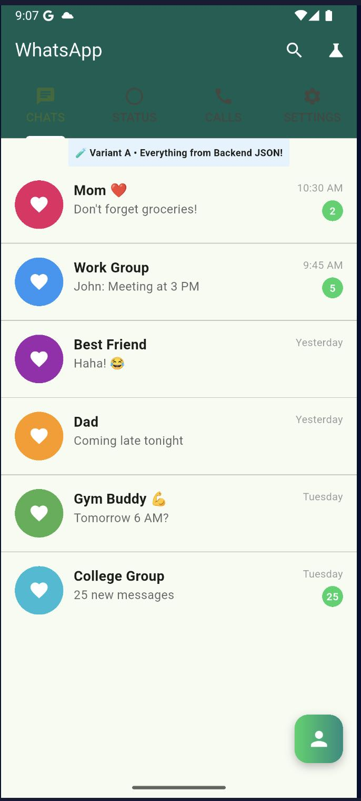
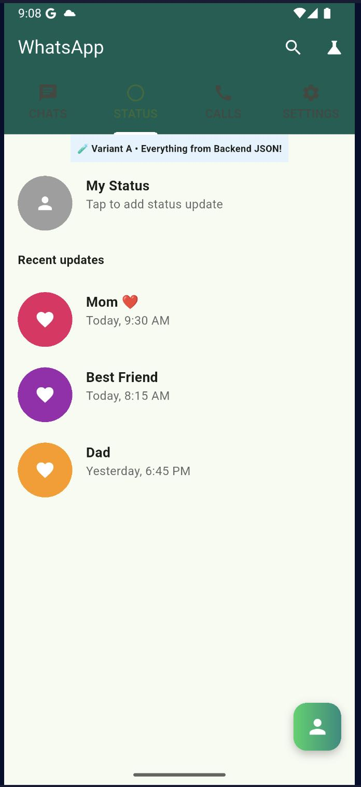
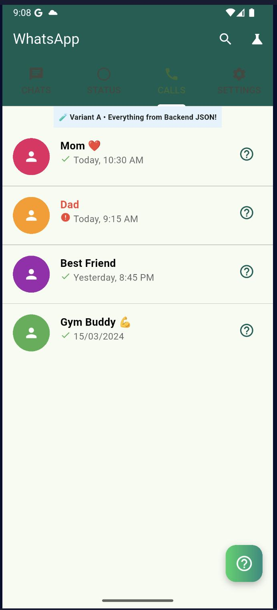
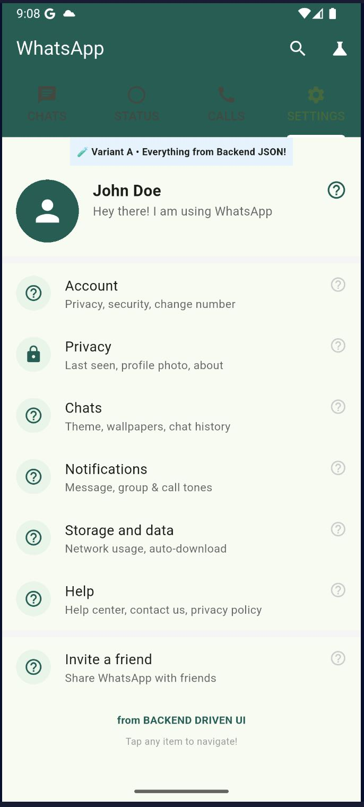

# Backend-Driven UI

[](https://pub.dev/packages/backend_driven_ui)
[](https://opensource.org/licenses/MIT)

**Flutter UIs That Update Themselves. Seriously.**

Server-driven UI framework with ApiWidget - build data-driven interfaces without FutureBuilder boilerplate.

---

## ✨ Features

- 🎯 **80+ Built-in Widget Types** - Fully interactive apps from JSON
- ⚡ **Zero App Releases** - Update UI from backend JSON instantly
- 🔓 **100% Open Source** - MIT licensed, yours forever
- 📦 **ApiWidget** - FutureBuilder's smarter, faster cousin
- 🚀 **Lightweight & Fast** - Optimized parsing, lazy loading
- 💎 **Production Ready** - Buttons, lists, gestures, caching
- 🔗 **State Binding** - `${state.key}` in any prop, reactive rebuilds
- 🎬 **Animations** - Entry animations on any widget via `animate` prop
- 📄 **Form Validation** - `Form` widget + `submitForm` action from JSON
- 🍎 **Cupertino Widgets** - iOS-native controls from JSON
- ♿ **Accessibility** - `Semantics` widget for screen readers
- 🌍 **i18n Validation** - Override all error messages globally

---

## 📸 Screenshots

> A WhatsApp-style UI built entirely from backend JSON — zero hardcoded screens.

| Chats | Status | Calls | Settings |
|-------|--------|-------|----------|
|  |  |  |  |

---

## 🚀 Quick Start

### Installation

```yaml
dependencies:
  backend_driven_ui: ^0.5.1
```

### Global Base URL (optional)

Set once at app startup to avoid repeating the full URL on every widget:

```dart
void main() {
  BduiConfig.baseUrl = 'https://api.myapp.com';
  runApp(MyApp());
}
```

All relative endpoints are then resolved automatically:

```dart
BackendDrivenScreen(endpoint: '/screens/home')  // → https://api.myapp.com/screens/home
ApiWidget(endpoint: '/products')                // → https://api.myapp.com/products
```

Full URLs (`https://...`) are always used as-is regardless of `baseUrl`.

---

## 📖 Documentation

### Backend-Driven UI (the wow factor)

Render an entire screen from a JSON schema your backend returns.
No app update needed — change the JSON, the UI changes instantly.

```dart
BackendDrivenScreen(
  endpoint: '/api/screens/home',
  cacheDuration: Duration(minutes: 5),
  onNavigate: (route, args) => Navigator.pushNamed(context, route),
)
```

**Backend returns JSON → Flutter renders the UI:**

```json
{
  "type": "Column",
  "props": { "mainAxisAlignment": "center" },
  "children": [
    {
      "type": "Text",
      "props": { "text": "Hello from Backend!", "fontSize": 24, "color": "#1976D2" }
    },
    { "type": "SizedBox", "props": { "height": 16 } },
    {
      "type": "ElevatedButton",
      "props": { "text": "Shop Now" },
      "action": { "type": "navigate", "route": "/shop" }
    }
  ]
}
```

#### Colors in JSON

Three formats are supported — use whichever fits your backend:

| Format | Example | Notes |
|--------|---------|-------|
| Named | `"color": "blue"` | All Flutter `Colors.*` names |
| `Colors.x` | `"color": "Colors.deepPurple"` | Flutter notation directly |
| Hex `#RRGGBB` | `"color": "#1976D2"` | Standard CSS hex |
| Hex `#AARRGGBB` | `"color": "#FF1976D2"` | With alpha channel |
| ARGB int | `"color": 4278190080` | Raw Flutter int |

#### Local Schema (no API call needed)

```dart
SchemaWidget.fromJson({
  "type": "Column",
  "children": [
    { "type": "Text", "props": { "text": "Hello from JSON!", "fontSize": 24 } }
  ]
})
```

---

### ApiWidget

The declarative way to fetch and display API data.

```dart
ApiWidget(
  endpoint: '/api/products/featured',
  method: HttpMethod.get,

  // Optional: Headers
  headers: {'Authorization': 'Bearer $token'},

  // Optional: Request body (for POST/PUT)
  body: {'category': 'electronics'},

  // Optional: Cache duration
  cacheDuration: Duration(minutes: 5),

  // Optional: Auto-refresh (polling)
  pollInterval: Duration(seconds: 30),

  // State widgets
  loadingWidget: CircularProgressIndicator(),

  successWidget: (data) {
    final products = data['products'] as List;
    return ProductGrid(products: products);
  },

  errorWidget: (error) {
    return ErrorCard(
      message: error,
      onRetry: () => setState(() {}),
    );
  },

  // Optional: Empty state
  emptyWidget: EmptyState(message: 'No products found'),

  // Optional: Callbacks
  onSuccess: (data) => print('Loaded ${data.length} products'),
  onError: (error) => print('Error: $error'),
)
```

#### Using ApiRequest (reusable request config)

Bundle all request parameters into one object — compose it outside the widget tree and reuse across screens:

```dart
final productsRequest = ApiRequest(
  endpoint: '/api/products',
  method: HttpMethod.get,
  headers: {'Authorization': 'Bearer $token'},
  cacheDuration: Duration(minutes: 5),
);

// Use it directly
ApiWidget(
  request: productsRequest,
  successWidget: (data) => ProductList(data),
)

// Derive a variant with copyWith
final filteredRequest = productsRequest.copyWith(
  endpoint: '/api/products?category=electronics',
);
```

#### Injecting a custom HTTP client

Implement `BduiHttpClient` to swap the network layer — useful for testing or custom HTTP libraries:

```dart
class MockHttpClient implements BduiHttpClient {
  @override
  Future<ApiResponse> get(String url, { ... }) async {
    return ApiResponse(statusCode: 200, data: {'products': []});
  }
  // implement remaining methods...
}

ApiWidget(
  endpoint: '/api/products',
  httpClient: MockHttpClient(),
  successWidget: (data) => ProductList(data),
)
```

#### Custom Widget Registration

Extend with your own widgets using `SchemaParser.register`:

```dart
final parser = SchemaParser();

parser.register('ProductCard', (schema, context) {
  final props = schema.props ?? {};
  return ProductCard(
    title: props['title'],
    price: props['price'],
    imageUrl: props['imageUrl'],
  );
});
```

**Use it from backend:**

```json
{
  "type": "ProductCard",
  "props": {
    "title": "iPhone 15",
    "price": 79999,
    "imageUrl": "https://cdn.app.com/iphone15.jpg"
  }
}
```

---

## 🎯 Advanced Features

### State Binding

Bind backend JSON to reactive state — widgets with `${state.key}` refs rebuild automatically when values change.

```dart
// Provide a shared state manager (optional — parser creates one automatically)
final stateManager = BduiStateManager();
final parser = SchemaParser(stateManager: stateManager);
```

**Backend JSON:**

```json
{
  "type": "Column",
  "children": [
    {
      "type": "TextField",
      "props": { "hint": "Your name", "stateKey": "name" }
    },
    {
      "type": "Text",
      "props": { "text": "Hello, ${state.name}!" }
    }
  ]
}
```

As the user types, the `Text` widget updates live — no `setState`, no streams.

**`stateKey` prop** is supported on `TextField`, `TextFormField`, `Switch`, and `Checkbox`.

**`setState` action** — set state from any button press:

```json
{
  "type": "ElevatedButton",
  "props": { "text": "Activate" },
  "action": { "type": "setState", "params": { "key": "status", "value": "active" } }
}
```

---

### Form Validation

```json
{
  "type": "Form",
  "props": { "formKey": "login", "autovalidateMode": "onUserInteraction" },
  "children": [
    {
      "type": "TextFormField",
      "props": {
        "hint": "Email",
        "stateKey": "email",
        "validators": ["required", "email"]
      }
    },
    {
      "type": "TextFormField",
      "props": {
        "hint": "Password",
        "stateKey": "password",
        "obscureText": true,
        "validators": ["required", "minLength:8"]
      }
    },
    {
      "type": "ElevatedButton",
      "props": { "text": "Sign In" },
      "action": { "type": "submitForm", "params": { "formKey": "login" } }
    }
  ]
}
```

**`autovalidateMode`**: `"disabled"` (default) | `"always"` | `"onUserInteraction"`

---

### Animations

Add an entry animation to any widget with the `animate` prop:

```json
{
  "type": "Card",
  "props": { "animate": "slideUp" },
  "child": { "type": "Text", "props": { "text": "Animated card" } }
}
```

Full config with timing:

```json
{
  "animate": {
    "type": "fadeIn",
    "duration": 400,
    "delay": 150,
    "curve": "easeOut"
  }
}
```

**Supported types:** `fadeIn`, `slideUp`, `slideDown`, `slideLeft`, `slideRight`, `scale`, `bounce`

**Curves:** `linear`, `easeIn`, `easeOut`, `easeInOut`, `bounceIn`, `bounceOut`, `elasticIn`, `elasticOut`, `fastOutSlowIn`

---

### PageView

Swipeable pages from backend JSON:

```json
{
  "type": "PageView",
  "props": { "scrollDirection": "horizontal" },
  "children": [
    { "type": "Text", "props": { "text": "Page 1" } },
    { "type": "Text", "props": { "text": "Page 2" } }
  ]
}
```

Dynamic pages with `PageView.builder`:

```json
{
  "type": "PageView.builder",
  "props": { "itemCount": 10 },
  "child": { "type": "Text", "props": { "text": "Page template" } }
}
```

---

### Action Handling

Execute actions from your backend schemas:

```json
{
  "type": "navigate",
  "route": "/products"
}
```

**Supported actions:**
- `navigate` - Navigate to a route
- `pop` - Go back
- `replace` - Replace current route
- `popUntil` - Pop to a named route (or root)
- `api` - Make API calls
- `showDialog` - Show alert dialogs (supports `onConfirm`, `onCancel`, `onDismiss`)
- `showSnackBar` - Show snackbars
- `showBottomSheet` - Show modal bottom sheets
- `launchUrl` - Open a URL (requires `onLaunchUrl` callback)
- `copy` - Copy text to clipboard
- `share` - Share text content
- `sequence` - Execute multiple actions in order
- `conditional` - Conditional execution
- `custom` - App-defined custom actions

### Caching & Performance

```dart
// Enable widget caching
final parser = SchemaParser(enableCache: true);

// Clear cache when needed
parser.clearCache();

// API caching
ApiWidget(
  endpoint: '/api/products',
  cacheDuration: Duration(minutes: 5), // Cache for 5 minutes
)
```

### Server-Controlled Caching

Let your backend control cache behavior per response:

```json
{
  "cachePolicy": "cache",
  "cacheTTL": 300,
  "ui": {
    "type": "Column",
    "children": [...]
  }
}
```

**Cache policies:**
- `cache` - Cache response (default)
- `noCache` - Never cache, always fetch fresh
- `refresh` - Return cached data, refresh in background (stale-while-revalidate)

**Handle background refresh:**
```dart
ApiWidget(
  endpoint: '/api/live-data',
  onBackgroundRefresh: (newData) {
    // UI automatically updates with fresh data
    print('Data refreshed in background!');
  },
)
```

### Auto-Retry & Error Handling

```dart
ApiWidget(
  endpoint: '/api/products',
  maxRetries: 3, // Retry up to 3 times
  showRetryButton: true, // Show retry button on error
  onError: (error) => logError(error),
)
```

---

### Accessibility (Semantics)

Wrap any widget with a `Semantics` node to add screen reader support:

```json
{
  "type": "Semantics",
  "props": {
    "label": "Submit login form",
    "button": true,
    "enabled": true
  },
  "child": {
    "type": "ElevatedButton",
    "props": { "text": "Sign In" },
    "action": { "type": "submitForm", "params": { "formKey": "login" } }
  }
}
```

**Available props:** `label`, `hint`, `value`, `button`, `enabled`, `readOnly`, `checked`, `toggled`, `selected`, `header`, `image`, `liveRegion`, `excludeSemantics`.

---

### Validation i18n

Override error message strings globally before `runApp`:

```dart
void main() {
  // French
  BduiValidatorMessages.required = 'Ce champ est obligatoire';
  BduiValidatorMessages.email = 'Adresse e-mail invalide';
  BduiValidatorMessages.minLength = (n) => 'Minimum $n caractères';
  BduiValidatorMessages.phone = 'Numéro de téléphone invalide';
  BduiValidatorMessages.url = 'URL invalide (doit commencer par http/https)';

  runApp(MyApp());
}
```

Restore English defaults at any time: `BduiValidatorMessages.reset()`.

**Available message fields:** `required`, `email`, `numeric`, `phone`, `url` — and factory fields: `minLength(n)`, `maxLength(n)`, `min(n)`, `max(n)`.

---

### GoRouter Integration

Pass GoRouter's navigation function as `onNavigate`:

```dart
BackendDrivenScreen(
  endpoint: '/screens/home',
  onNavigate: (route, {arguments}) {
    context.go(route, extra: arguments);
  },
)
```

For `ApiWidget` with schema rendering, pass the same callback to `SchemaParser`:

```dart
final parser = SchemaParser(
  onNavigate: (route, {arguments}) => context.go(route, extra: arguments),
);
```

---

### Riverpod Integration

Expose `BduiStateManager` as a provider so Dart code and backend JSON share the same state:

```dart
final bduiStateProvider = ChangeNotifierProvider((_) => BduiStateManager());

// In your widget tree:
final stateManager = ref.watch(bduiStateProvider);
final parser = SchemaParser(stateManager: stateManager);
```

Backend JSON can then write state with `setState` actions and your Riverpod listeners see the changes immediately — no extra plumbing required.

---

### Pagination with ApiWidget

Combine `ApiWidget` with a page counter in `BduiStateManager` for infinite scroll:

```dart
final stateManager = BduiStateManager()..set('page', 1);
final parser = SchemaParser(stateManager: stateManager);
```

Backend JSON drives the "Load more" button:

```json
{
  "type": "ElevatedButton",
  "props": { "text": "Load more" },
  "action": {
    "type": "setState",
    "params": { "key": "page", "value": 2 }
  }
}
```

In Dart, watch the `page` key and re-fetch:

```dart
stateManager.addListener(() {
  final page = stateManager.get('page') as int? ?? 1;
  ref.read(productsProvider(page).notifier).fetch();
});
```

---

## 📚 Schema Reference

See the [Schema Reference](https://igloodev.in/docs/backend-driven-ui/schema) for complete documentation of all 80+ widgets, props, actions, and conditions — also available as [SCHEMA_REFERENCE.md](./SCHEMA_REFERENCE.md).

---

## 📱 Examples

Check out the [example](./example) directory for complete samples:

- **ApiWidget Examples** - Basic & list API calls with caching
- **Backend-Driven UI** - JSON schema rendering
- **Local Schema** - Use JSON without API calls
- **Conditional Rendering** - Platform & theme-based UI

---

## 🤝 Contributing

Contributions are welcome! Feel free to [open issues](https://github.com/igloodev/backend_driven_ui/issues) or submit pull requests on [GitHub](https://github.com/igloodev/backend_driven_ui).

---

## 📄 License

MIT License - see [LICENSE](LICENSE) file for details.

---

## 🌟 Show Your Support

If you like this package, please give it a ⭐ on [GitHub](https://github.com/igloodev/backend_driven_ui)!

---

**Built with ❤️ for the Flutter community**
